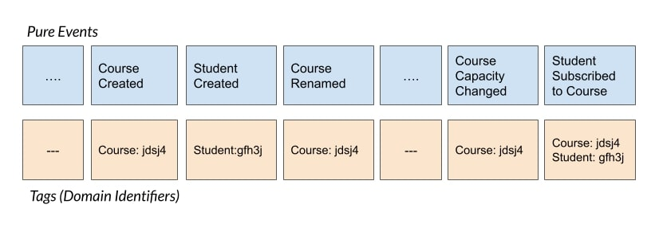

# Event Store

> Disclaimer: This project is for educational purposes only and represents my own view on the DCB concept.

The simplest possible API and in-memory implementation of an Event Store. The API supports basics of [DCB (Dynamic
Consistency Boundary) concept](https://www.youtube.com/watch?v=IgigmuHHchI).

If you are already familiar with DCB concepts, you might want to check out the [sample](sample-faculty/readme.md) right
away. Otherwise, continue reading to get yourself familiar with the concepts.

Although simple, the Event Store API contains enough concepts to cover basic functionalities of an Event Store. It
contains two operations:

* _read_ - reads a finite stream of events from the Event Store based on provided _criteria_.
* _append_ - appends events at the end of the Event Store log. It accepts the _consistency condition_ as the parameter
  used to check the consistency of this _append_.

> This Event Store is missing _stream_ operation which would provide an indefinite stream of events based on certain
> _criteria_.

Before we explore the details of _read_ and _append_ let's explain the necessary terms in order to better understand
mechanics of the Event Store.

| term              | definition                                                                                                                                                                                                                     |
|-------------------|--------------------------------------------------------------------------------------------------------------------------------------------------------------------------------------------------------------------------------|
| _global sequence_ | Each event in the Event Store is associated with _global sequence_ number which determines its position in the globally ordered Event Store log. The _global sequence_ of the very first event is 0.                           |
| _head_            | _global sequence_ of the very first event to be appended to the Event Store                                                                                                                                                    |
| _index_           | Specifies the event in more details. Event Store must store _indices_ together with events and provide a search based on them. Usually, an Event Store index events based on indices for faster retrieval.                     |
| _criterion_       | Integral part of the _criteria_. It is composed of _indices_. Between them, an AND operator is applied - for an event to meet the _criterion_, all of the _indices_ of the event must be matched with the _criterion indices_. |
| _criteria_        | Filters out events from the Event Store. It is composed of _criterions_. Between them, an OR operator is applied - for an event to meet the _criteria_, only one _criterion_ should be satisfied.                              |

### How to use criteria for filtering?

The best way to understand how criteria-based filtering works is to use an example. In this case we have a Student that
can enroll a Course. There are events for student and course creation, renaming the course, course capacity change, and
an event that student enrolled the course. The event stream is depicted in the image below.



All these events are indexed with specific Domain Identifiers. Certain events, like the fact that student subscribed to 
a course, are indexed with two indices - student and the course. The reason is that this event belongs to both, student 
and course domain concepts.

In order to handle student subscription command, we need to source our model based on the events we are interested in.
In our case, those are events depicting whether the course capacity has changed and the fact that student has subscribed
to a course. Let's see how to form a criteria for this use-case:

```java
criteria(criterion(index("eventType", "CourseCapacityChanged"),
                   index("courseId", "jdsj4")),
         criterion(index("eventType", "StudentSubscribedToCourse"),
                   index("courseId", "jdsj4")),
         criterion(index("eventType", "StudentSubscribedToCourse"),
                   index("studentId", "gfh3j")))
```

Another interesting scenario would be to check whether the student subscribed to a course. 

```java
criteria(criterion(index("eventType", "StudentSubscribedToCourse"),
                   index("studentId", "gfh3j"),
                   index("courseId", "jdsj4")))
```

## _read_

_read_ operation provides _marked events_ - all events matching the given _criteria_, starting from the given
_sequence_. These events are _marked_ with Event Store _consistency marker_ at the time they are requested.

## _append_

During the _append_ each event is indexed with a set of indices associating this event with certain concepts from the
_Domain_, or geospatial data, or technical aspects, or anything user-defined. It would be odd to see an index that does 
not already belong to the _payload_ of the event. _append_ accepts the event to be appended (obviously) and the 
_consistency condition_ denoting consistency requirements for the _append_. _consistency condition_ is composed of 
_consistency marker_ and _criteria_.

_consistency marker_ is telling the Event Store to start searching for events matching given _criteria_ after its
position. If there are no events matching the _criteria_ after the _consistency marker_, consistency condition is
fulfilled and the _append_ is accepted, otherwise, it's not.

As a convenience the _read_ operation returns events _marked_ with the _consistency marker_ of the Event Store. The
command model uses _read_ operation to source its state and make the decision based on the state. This decision is
usually appending an event(s) to the Event Store. **This exact command model is going to use the _consistency marker_
from the _read_ operation as the _consistency marker_ for the _append_ operation.**